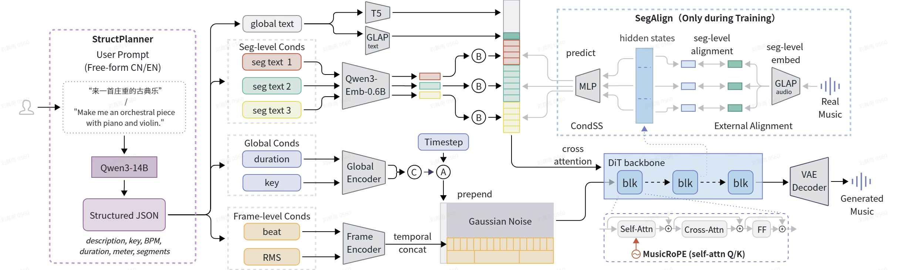

<div align="center">

# MuseGran

**Multi-Granularity Conditioning with Music-Aware Position Encoding for Long-Form Music Generation**

### IEEE SLT 2026

[](https://musegran.github.io/demo/)
[](#)
[](#)

A DiT-based latent diffusion model for long-form instrumental music generation with **multi-granularity conditioning (global, segment, and frame level)** — up to ~180 seconds of 44.1 kHz stereo audio.

</div>

## Architecture

<p align="center">
  
</p>

## Quick Start

```bash
pip install -e .
```

Or with [uv](https://docs.astral.sh/uv/) (recommended):

```bash
uv sync
source .venv/bin/activate   # or prefix commands with `uv run`
```

## Models

MuseGran provides two model variants:

| | **MuseGran-Qo** (quality-oriented) | **MuseGran-Co** (control-oriented) |
|---|---|---|
| Global text prompt | ✓ | ✓ |
| Key | ✓ | ✓ |
| Beat / downbeat | ✓ | ✓ |
| Segment structure | — | ✓ |
| Checkpoint | `musegran_qo.ckpt` | `musegran_co.ckpt` |
| Strength | **better musicality** | **fine-grained arrangement control** |

### Checkpoints

Download the model weights from the [model release](#) and place them in `pretrained_models/` (model configs are versioned in this repo under `configs/model/`, no download needed):

```
pretrained_models/
├── diffusion/
│   ├── musegran_co.ckpt          # MuseGran-Co (control-oriented)
│   └── musegran_qo.ckpt          # MuseGran-Qo (quality-oriented)
├── vae/
│   └── vae_sr.ckpt               # Oobleck VAE with super-resolution decoder
└── structplanner_lora/
    └── adapter_model.safetensors # Fine-tuned LoRA weights (step 29500)
```

Copy the StructPlanner adapter config from this repo next to the adapter weights:

```bash
cp configs/structplanner/adapter_config.json pretrained_models/structplanner_lora/
```

External model weights (Qwen3-14B, Qwen3-Embedding-0.6B, GLAP, T5) are loaded from HuggingFace or a local path on first run.

## Inference

### MuseGran-Qo

- **Single prompt**

```bash
python inference.py --prompt "Ambient electronica with pads" --bpm 90 --key "C minor" --duration 120
```

- **Batch (JSONL)**

```json
{"prompt": "A calming journey through acoustic instruments", "bpm": 76.0, "key": "F major", "duration_seconds": 140}
```

```bash
python inference.py --test_jsonl ./inference_samples/prompts_qo.jsonl
```

### MuseGran-Co

- **Single (JSON)** — segment structure cannot be passed via command-line flags; provide it as a JSON file:

```bash
python inference.py --structure_json ./inference_samples/prompts_co_single.json
```

- **Batch (JSONL)**

```bash
python inference.py --test_jsonl ./inference_samples/prompts_co_batch.jsonl
```

### StructPlanner

StructPlanner is a Qwen3-14B model fine-tuned with LoRA that converts prompts in both CN/EN into a complete structured spec (key, BPM, meter, per-segment style/dynamics/instrumentation, and text descriptions) — an alternative to hand-writing the structure for Co inference.

Enable it with `--structplanner`; `--duration`, `--bpm`, `--key` are ignored (all parameters come from the generated spec):

```bash
python inference.py --prompt "安静的钢琴曲" --structplanner
python inference.py --prompt "Epic orchestral battle music" --structplanner
```

## Training

### Data Format

Training data is a JSONL file (one sample per line). See `data/train_examples.jsonl` for complete examples.

> **Example audio:** The two clips in `data/examples/audio/` are sampled from the [Free Music Archive (FMA)](https://github.com/mdeff/fma), filtered to commercially-usable licenses (CC BY, CC BY-SA, CC BY-ND, Public Domain, Commercial Use). See the [FMA search filter](https://freemusicarchive.org/search?adv=1&only-instrumental=1&music-filter-CC-attribution-only=1&music-filter-CC-attribution-sharealike=1&music-filter-CC-attribution-noderivatives=1&music-filter-public-domain=1&music-filter-commercial-allowed=1) for details. Note that `beat_path` and `vae_latent_path` referenced in `data/train_examples.jsonl` are not included; generate beat annotations with [madmom](https://github.com/CPJKU/madmom) or [BeatNet](https://github.com/mjhydri/BeatNet), and VAE latents via the provided VAE checkpoint.

<details>
<summary><b>Annotation extraction tools</b></summary>

The following tools were used to generate the annotations in `data/train_examples.jsonl` and can be used to prepare your own dataset:

| Field | Tool |
|-------|------|
| `key`, `bpm` | [Essentia](https://github.com/MTG/essentia/tree/a770d1bc2b3f9fb3cefa835dcf5eb6a6e05e0f07) |
| `beat_path` | [madmom](https://github.com/CPJKU/madmom) / [BeatNet](https://github.com/mjhydri/BeatNet) |
| `detailed_prompt`, `genre`, `instruments`, `mood` | [MusicFlamingo](https://github.com/NVIDIA/audio-flamingo/tree/music_flamingo) |
| `structure_segments_json` (segmentation) | [SongFormer](https://github.com/ASLP-lab/SongFormer/tree/main) |
| `structure_segments_json` (per-segment text) | [MusicFlamingo](https://github.com/NVIDIA/audio-flamingo/tree/music_flamingo) |

</details>

During training, the text input is randomly selected from `prompt`, `detailed_prompt`, or shuffled keywords (from `genre`/`instruments`/`mood`) for robustness to varied text inputs at inference time.

### Evaluation Metrics (Optional)

Training periodically generates demo audio and scores them. Install these dependencies **before** starting training if you want automatic evaluation:

```bash
git clone https://github.com/facebookresearch/audiobox-aesthetics
cd audiobox-aesthetics && pip install -e . && cd ..

git clone https://github.com/ASLP-lab/SongEval score_tools/songeval/SongEval
```

- **AudioBox Aesthetics** — perceptual quality (CE, CU, PC, PQ)
- **SongEval** — coherence, musicality, memorability, clarity

### Run Training

```bash
python train.py --config configs/training/default.yaml
```

Training configs are in `configs/training/`. Command-line arguments override config values.

## Citation

The paper is accepted at IEEE SLT 2026; a formal BibTeX entry will be added once it is published.

## License

The code and model weights are released under the Apache License 2.0 (see [LICENSE](LICENSE)).

## Acknowledgments

This project is inspired by [stable-audio-tools](https://github.com/Stability-AI/stable-audio-tools) and [MusiConGen](https://github.com/YatingMusic/MusiConGen).
